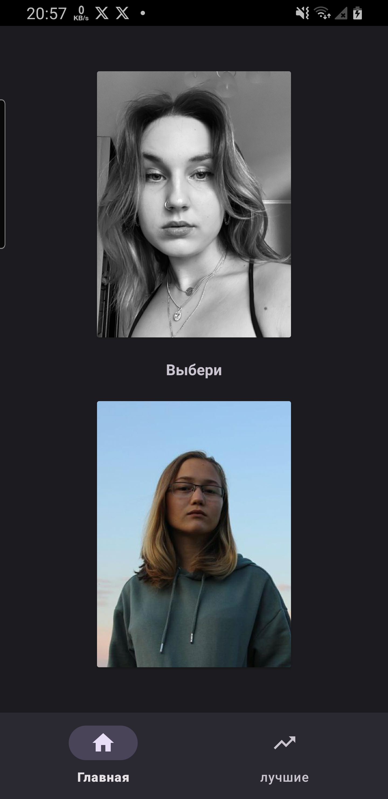
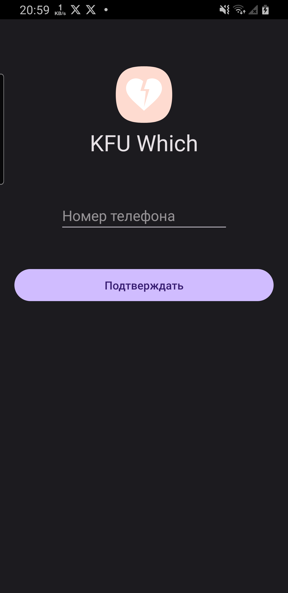

# KFURate
### All students of Kazan Federal university in one app ❤️

## Developed with:
* Kotlin
* Coroutines 
* DataStore
* Koil
* MVVM
* Retrofit

## Android build instructions

1. Clone this repo.
2. Open the directory in Android Studio 3.2 or later.
3. Connect your phone
4. Click the green "play" triangle button.
